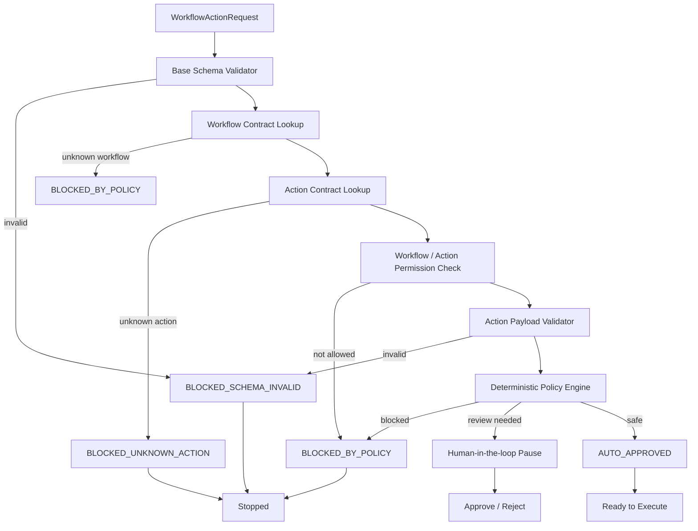

# Schema-Driven Policy Workflow Agent

[](https://github.com/PouyaPour/schema-driven-policy-workflow-agent/actions/workflows/ci.yml)


A production-oriented governance layer that evaluates workflow action requests
**before** execution. Each request is validated against a base schema, matched
against workflow and action contracts (served through a read-only MCP layer),
and evaluated by a **deterministic policy engine**. The LLM is kept out of the
authority path — it only formats human-review messages and audit summaries,
while approve / review / block decisions stay reproducible and policy-driven.

## Why I built this

In my backend work on fintech and workflow-automation systems, I often deal with
actions that must not execute just because an automation selected them. Some
actions are safe, some need review, and some must be denied by default.

This project turns that production concern into a compact agentic governance
system: schema contracts define what is allowed, a deterministic policy engine
makes the decision, MCP exposes read-only context, and the LLM stays outside the
approval authority path.

## Why this design

- **Deterministic authority.** Decisions come from the policy engine, not the
  LLM. `defaults.llm_can_override_decision: false` is enforced in the policy
  file and structurally in code (`Decision` is a frozen dataclass). Every
  decision is auditable and reproducible.
- **Fail-closed.** Unknown workflows, unknown actions, invalid schemas, and
  unrecognized human input are all denied by default.
- **Schema as contract.** Contracts drive validation, policy, and evaluation
  baselines from one source instead of scattering rules across code.
- **Trusted vs untrusted inputs.** Inherent action properties like
  `external_side_effect` come from the action contract, never from the request.

## Quick start

```bash
python3 -m venv .venv
source .venv/bin/activate

python -m pip install --upgrade pip setuptools wheel
python -m pip install -e ".[dev]"

python -m pytest -q             # full unit + behavior + ADK integration suite
python eval_runner.py           # 14 evaluation cases, exit code 0 (CI-friendly)
python mcp/client_demo.py       # spawns the MCP server over stdio, calls all 4 tools
```

## Quick demo

Run a local governance decision:

```bash
python - <<'PY'
from app.agent import WorkflowGovernanceAgent

agent = WorkflowGovernanceAgent()

request = {
    "request_id": "req_demo_001",
    "workflow_id": "customer_onboarding",
    "requester": {"id": "user_1", "role": "operator"},
    "environment": "staging",
    "target_action": "send_email",
    "action_payload": {
        "recipient": "[[APPROVED_TEST_EMAIL]]",
        "subject": "Welcome",
        "body": "Hello"
    },
    "risk_context": {"contains_pii": False, "monetary_value": None}
}

print(agent.handle_request(request))
print(agent.handle_request(request, human_decision="approve"))
PY
```

Expected behavior: the first call pauses the request for human review
(`PENDING_HUMAN_REVIEW`); the second call resumes after approval
(`APPROVED_BY_HUMAN`). The policy decision itself remains
`REQUIRES_HUMAN_REVIEW` in both — human approval changes workflow status,
never the policy decision.

## Decision types

`AUTO_APPROVED` · `REQUIRES_HUMAN_REVIEW` · `BLOCKED_BY_POLICY` ·
`BLOCKED_UNKNOWN_ACTION` · `BLOCKED_SCHEMA_INVALID`

## Architecture



The execution order is authoritative (fail-closed, earliest layer wins): the
pipeline stops at the earliest failing layer rather than collecting all
problems and ranking them.

## Authority boundary

The LLM is not part of the approval authority path.

The deterministic policy engine owns `decision`, `risk_level`, and
`reason_codes`. The formatter (or a future LLM formatter) may only produce
`human_review_message` and `audit_summary` — enforced structurally by a
frozen dataclass and verified by immutability tests.

Human approval can resume only requests that already require review. It cannot
override blocked policy decisions, and unrecognized human input keeps a
request pending rather than approving it.

## HITL model

`AUTO_APPROVED → READY_TO_EXECUTE` · blocked decisions → `STOPPED`
(terminal — human approval is deliberately ignored) ·
`REQUIRES_HUMAN_REVIEW → PENDING_HUMAN_REVIEW`, then `APPROVED_BY_HUMAN` /
`REJECTED_BY_HUMAN` once a reviewer decides. In the ADK version
(`app/adk_agent.py`, a custom `BaseAgent` that needs no model or credentials),
the pause/resume cycle flows through session state — a RequestInput-style
human-in-the-loop behavior where an authenticated approval surface would write
the reviewer's decision and resume the paused run.

## MCP layer (read-only by design)

`mcp/server.py` exposes `get_workflow_contract`, `get_action_contract`,
`get_policy_rules`, and `list_allowed_actions`. It wraps the same
`ContractProvider` the policy engine uses — one source of truth, two access
paths. Per spec section 17, the server has no side effects and grants no
decision authority: an agent can read every rule and still cannot approve or
block anything.

## What this project is not

This is not a chatbot, an expense-demo clone, a real payment system, a real
email sender, a production approval dashboard, or a system where the LLM
decides whether something is safe. It is a small but production-oriented
governance layer for agentic workflow actions.

## Layout

```
schema-driven-policy-workflow-agent/
├── README.md
├── SUBMISSION.md
├── pyproject.toml
├── eval_runner.py
├── specs/
│   ├── capstone-spec.md          # source of truth
│   ├── behavior-scenarios.feature
│   └── evaluation-cases.yaml     # 14 behavioral cases
├── schemas/
│   ├── workflow_contracts.yaml
│   └── action_contracts.yaml
├── policies/
│   └── policies.yaml
├── app/
│   ├── models.py                 # frozen Decision, enums, reason codes
│   ├── contract_loader.py        # ContractProvider (YAML now, MCP-swappable)
│   ├── schema_validator.py       # base request + action payload validation
│   ├── policy_engine.py          # the deterministic authority
│   ├── message_formatter.py      # presentation only
│   ├── agent.py                  # local governance agent (Phase 5A)
│   └── adk_agent.py              # ADK wrapper with HITL pause/resume (Phase 5B)
├── mcp/
│   ├── server.py                 # read-only FastMCP governance server
│   └── client_demo.py
├── tests/                        # unit + evaluation-order + behavior + ADK tests
└── .agents/skills/workflow-policy-review/SKILL.md
```

## Status

- **Phase 0 (spec lock):** complete — spec, scenarios, eval cases.
- **Phase 1 (contracts & policies):** complete — workflow/action contracts, policies.
- **Phase 2 (core engine):** complete — models, validators, policy engine, formatter.
- **Phase 3 (tests & eval runner):** complete — unit/behavior tests green, eval runner green.
- **Phase 4 (MCP read-only server):** complete — 4 read-only governance tools verified through `client_demo.py`.
- **Phase 5 (agent wrapper + HITL):** complete — local governance agent and ADK-style HITL pause/resume through session state, both tested.
- **Phase 6 (agent skill + polish):** complete — `workflow-policy-review` skill, README, `SUBMISSION.md`.
- **Phase 7 (optional deployment):** planned.

## Course coverage

Day 1 spec-first SDLC · Day 2 MCP contract/policy access · Day 3 review skill +
evaluation cases · Day 4 deny-by-default guardrails and authority boundary ·
Day 5 agent wrapper, HITL pause/resume, tests, and eval runner.

## Roadmap (future work)

Full idempotency / duplicate detection · runtime placeholder resolution
(`[[APPROVED_TEST_EMAIL]]`) · authenticated approval dashboard · real
notification integrations · Agent Runtime deployment · role-based approval
routing · spec-to-evaluation and spec-to-node generation.
