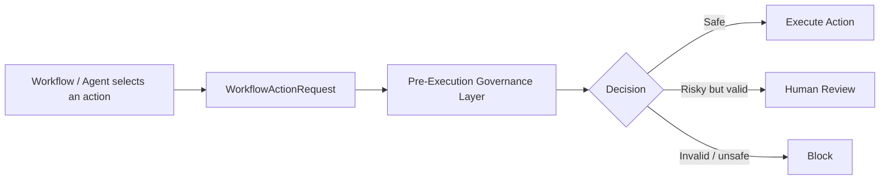
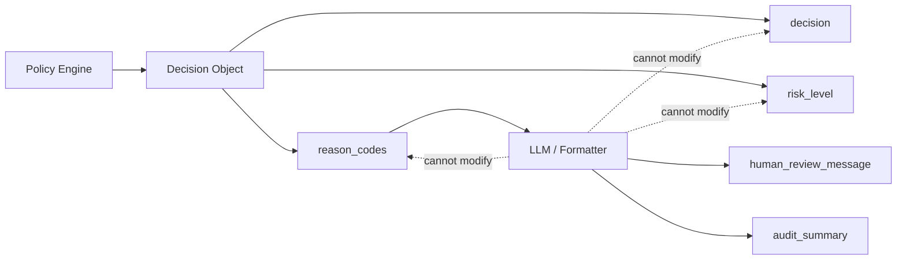

# Schema-Driven Policy Workflow Agent — Capstone Specification

> This document is the **source of truth** for the project. Implementation, tests, evaluation cases, MCP tools, and ADK agent behavior must conform to this specification. If the code and this document disagree, the spec wins until the spec is deliberately updated.

---

## 1. Project Summary

**Schema-Driven Policy Workflow Agent** is a production-oriented agentic workflow governance project.

The system receives a `WorkflowActionRequest` at the moment when a workflow action is about to be executed. It does **not** decide which action should be selected. Instead, it acts as a pre-execution governance layer that determines whether the selected action is safe, valid, allowed, needs human approval, or must be blocked.

The core idea is simple:

> A workflow says: "I want to execute this action."
> The governance agent says: "Are you allowed to execute it?"

Each request is evaluated through a deterministic pipeline:

1. Validate the base request schema.
2. Load the workflow contract.
3. Load the action contract.
4. Deny unknown actions by default.
5. Validate action-specific payload requirements.
6. Apply deterministic policy rules.
7. Pause risky but valid requests for human-in-the-loop review.
8. Auto-approve only safe, low-risk requests.
9. Format a human-readable message and audit summary.

The LLM is intentionally kept **outside the approval authority path**. It can explain decisions, but it cannot make or override them.

---

## 2. Problem Statement

Modern agentic and workflow systems can generate, select, and execute actions quickly. This speed creates a production risk: an agent or workflow might attempt to execute an action that is incomplete, unknown, unsafe, disallowed, or too risky to run automatically.

In traditional codebases, these rules are often scattered across controllers, services, jobs, and integrations. Over time, this creates inconsistent behavior, weak auditability, duplicated checks, and unclear ownership of business and platform policies.

This project demonstrates a cleaner approach:

- Treat schemas and contracts as operational source-of-truth.
- Keep approval decisions deterministic and reproducible.
- Deny invalid or unknown actions by default.
- Separate policy decisions from LLM-generated explanations.
- Use human-in-the-loop checkpoints for risky but valid actions.
- Verify behavior through tests and evaluation cases.

---

## 3. Goals

### 3.1 Functional Goals

- Accept a workflow action request before execution.
- Validate that the request is structurally complete.
- Verify that the workflow is known.
- Verify that the action is known.
- Verify that the action is allowed for the requested workflow.
- Validate the action-specific payload requirements.
- Apply deterministic blocking and review policies.
- Return one of five decision types:
  - `AUTO_APPROVED`
  - `REQUIRES_HUMAN_REVIEW`
  - `BLOCKED_BY_POLICY`
  - `BLOCKED_UNKNOWN_ACTION`
  - `BLOCKED_SCHEMA_INVALID`
- Emit stable, machine-readable `reason_codes`.
- Produce human-readable messages from the deterministic decision object.

### 3.2 Engineering Goals

- Keep policy logic testable and reproducible.
- Keep contracts in YAML instead of hiding rules inside scattered code paths.
- Make the evaluation order explicit and deterministic.
- Support MCP-backed read-only contract lookup.
- Support an ADK wrapper for graph workflow orchestration and human-in-the-loop pause.
- Keep the core policy engine runnable locally without cloud deployment.

### 3.3 Learning / Capstone Goals

This project is designed to demonstrate the main concepts of the 5-Day AI Agents course:

- Spec-first development.
- Agentic workflow design.
- MCP-based tool/context access.
- Agent skills and reusable review workflows.
- Security guardrails and deny-by-default behavior.
- Human-in-the-loop approval.
- Evaluation cases for agent behavior.
- Optional production deployment using Agents CLI / Agent Runtime.

---

## 4. Non-Goals for v1

The first implementation intentionally avoids production infrastructure complexity.

The following are **not** part of v1:

- Real payment execution.
- Real email sending.
- Real external API mutation.
- Real SMS, push notification, or MFA approval flow.
- Full frontend manager dashboard.
- Full idempotency state store or duplicate detection window.
- Runtime placeholder resolution.
- Complex role-based access control.
- Deep JSON Schema validation.
- Production deployment as a mandatory requirement.
- Real business, customer, or company data.

v1 focuses on the deterministic governance core. MCP, ADK/HITL, and deployment can be added incrementally after the core engine and tests are stable.

---

## 5. Conceptual Boundary

This project starts **after** an action has already been selected.

It does not answer:

> "Which action should the workflow execute?"

It answers:

> "This action is about to execute. Is it valid, allowed, safe, review-required, or blocked?"

The project therefore represents a **pre-execution governance layer**.



---

## 6. Authority Boundary

The deterministic Policy Engine is the **only authority** that can produce approval decisions.

The LLM is intentionally kept outside the authority path.

### 6.1 LLM May Do

The LLM may only:

1. Convert deterministic `reason_codes` into a human-readable review message.
2. Produce a concise audit summary from the final decision object.
3. Improve readability of explanations without changing the underlying decision.

### 6.2 LLM May Not Do

The LLM may not:

- Change `decision`.
- Change `risk_level`.
- Add, remove, or rewrite `reason_codes`.
- Override policy rules.
- Approve a blocked request.
- Block an approved request.
- Convert a review-required request into an auto-approved request.

### 6.3 Enforced Policy Flag

The policy file must explicitly include:

```yaml
defaults:
  llm_can_override_decision: false
```

Any implementation that allows the LLM to mutate `decision`, `risk_level`, or `reason_codes` violates this specification.



---

## 7. Data Model: WorkflowActionRequest

A `WorkflowActionRequest` represents a selected workflow action that is about to be executed.

### 7.1 Example Request

```json
{
  "request_id": "req_0001",
  "workflow_id": "customer_onboarding",
  "workflow_run_id": "run_001",
  "requester": {
    "id": "user_1",
    "role": "operator"
  },
  "environment": "staging",
  "target_action": "generate_report",
  "action_payload": {
    "report_type": "summary",
    "format": "pdf"
  },
  "risk_context": {
    "contains_pii": false,
    "monetary_value": null
  }
}
```

### 7.2 Required Fields

```yaml
WorkflowActionRequest:
  required:
    - request_id
    - workflow_id
    - requester
    - environment
    - target_action
    - action_payload
    - risk_context
```

### 7.3 Field Semantics

| Field | Meaning |
|---|---|
| `request_id` | Required correlation and idempotency-lite key. Used for audit, traceability, and future duplicate detection. Missing value fails base schema validation. |
| `workflow_id` | Identifies the workflow definition, not a specific runtime instance. Example: `customer_onboarding`. |
| `workflow_run_id` | Optional runtime/session identifier for a specific execution. Useful for future Agent Runtime / session mapping. |
| `requester` | The actor that initiated or owns the request. v1 only requires `id` and `role`. Complex RBAC is future work. |
| `environment` | Execution environment: `local`, `staging`, or `production`. |
| `target_action` | The action the workflow wants to execute. It must exist in `action_contracts.yaml`. Unknown actions are denied by default. |
| `action_payload` | Action-specific data required to execute the action. Validated against the selected action contract. |
| `risk_context` | Runtime risk signals such as PII presence or monetary value. It does not define inherent action properties. |

### 7.4 Important Modeling Rule

`external_side_effect` is **not trusted from user input**.

It is derived from the action contract.

Reason: the requester should not be allowed to claim that an action such as `send_email` has no external side effect. Inherent action risk belongs to the action contract, not to the runtime request.

### 7.5 Monetary Value

`amount` and `currency` never live at the request root. Monetary risk is represented only inside:

```json
"risk_context": {
  "monetary_value": {
    "amount": 250,
    "currency": "USD"
  }
}
```

For non-monetary actions, `monetary_value` is `null`.

---

## 8. Workflow Contracts

Workflow contracts define which actions are allowed inside each workflow.

File:

```text
schemas/workflow_contracts.yaml
```

Initial v1 contract:

```yaml
workflows:
  customer_onboarding:
    allowed_actions:
      - generate_report
      - send_email
      - external_api_call

  internal_reporting:
    allowed_actions:
      - generate_report

  incident_escalation:
    allowed_actions:
      - generate_report
      - external_api_call
```

### 8.1 Workflow / Action Permission Rule

An action can be known globally but still disallowed for a specific workflow.

Example:

- `send_email` is a known action.
- `internal_reporting` only allows `generate_report`.
- Therefore, `send_email` inside `internal_reporting` is blocked.

Decision:

```text
BLOCKED_BY_POLICY
```

Reason code:

```text
ACTION_NOT_ALLOWED_FOR_WORKFLOW
```

---

## 9. Action Contracts

Action contracts define the inherent risk and required payload fields for each known action.

File:

```text
schemas/action_contracts.yaml
```

Initial v1 contract:

```yaml
actions:
  generate_report:
    risk_level: low
    external_side_effect: false
    required_payload_fields:
      - report_type
      - format
    allowed_environments:
      - local
      - staging
      - production
    requires_human_review_when: []

  send_email:
    risk_level: high
    external_side_effect: true
    required_payload_fields:
      - recipient
      - subject
      - body
    allowed_environments:
      - staging
      - production
    blocked_environments:
      - local
    requires_human_review_when:
      - contains_pii
      - production_environment
      - external_side_effect

  external_api_call:
    risk_level: medium
    external_side_effect: true
    required_payload_fields:
      - endpoint_alias
      - method
    allowed_environments:
      - staging
      - production
    requires_human_review_when:
      - production_environment
      - contains_pii
      - external_side_effect
```

### 9.1 Action Payload Validation Scope for v1

v1 action payload validation checks **required field presence only**.

Example:

`send_email` requires:

```yaml
required_payload_fields:
  - recipient
  - subject
  - body
```

If `subject` is missing, the result is:

```text
BLOCKED_SCHEMA_INVALID
```

Reason code:

```text
INVALID_ACTION_PAYLOAD
```

Deep type validation, regex validation, nested JSON Schema, and provider-specific validation are future work.

---

## 10. Policy Rules

Policy rules define blocking, review, and auto-approval behavior.

File:

```text
policies/policies.yaml
```

Initial v1 policy:

```yaml
defaults:
  unknown_action: block
  unknown_workflow: block
  schema_invalid: block
  llm_can_override_decision: false
  review_condition_operator: OR

auto_approval:
  allowed_risk_levels:
    - low
  allowed_environments:
    - local
    - staging
  requires_no_pii: true
  requires_no_external_side_effect: true

blocking:
  local:
    blocked_actions:
      - send_email
      - external_api_call
      - execute_payment

human_review:
  condition_operator: OR
  conditions:
    - contains_pii
    - production_environment
    - high_risk_action
    - external_side_effect
    - monetary_value_requires_review
  monetary_value_threshold:
    amount_gte: 100
    currency: USD

idempotency:
  request_id_required: true
  duplicate_detection: future_work
```

### 10.1 Deny by Default

Unknown workflows and unknown actions are denied by default.

The system is fail-closed, not fail-open.

### 10.2 Review Condition Semantics

`requires_human_review_when` and `human_review.conditions` use **OR semantics**.

If any listed condition is true, the request requires human review.

Example:

```yaml
requires_human_review_when:
  - contains_pii
  - production_environment
  - external_side_effect
```

Means:

```text
contains_pii == true
OR environment == production
OR action_contract.external_side_effect == true
```

### 10.3 Monetary Review Threshold

If `risk_context.monetary_value` is present and meets or exceeds the configured threshold, human review is required.

Example:

```yaml
monetary_value_threshold:
  amount_gte: 100
  currency: USD
```

A request with:

```json
"monetary_value": {
  "amount": 250,
  "currency": "USD"
}
```

Triggers:

```text
REQUIRES_HUMAN_REVIEW
```

Reason code:

```text
MONETARY_VALUE_REQUIRES_REVIEW
```

Currency conversion is future work. v1 only compares values when the currency matches the configured threshold currency.

### 10.4 High-Risk Action Mapping

The `high_risk_action` review condition is derived from the trusted action contract, not from runtime input.

Definition:

```text
high_risk_action == (action_contract.risk_level == "high")
```

This means a valid high-risk action, such as `send_email`, requires human review whenever it reaches the human-review layer, even if it does not contain PII.

Blocking rules still run earlier. For example, `send_email` in `local` is blocked by policy before the high-risk review condition is evaluated.

---

## 11. Decision Types

The system returns exactly one decision.

| Decision | Meaning |
|---|---|
| `AUTO_APPROVED` | The request is valid, known, low-risk, policy-compliant, and does not require human review. |
| `REQUIRES_HUMAN_REVIEW` | The request is valid and known, but one or more review conditions matched. Execution must pause for human approval. |
| `BLOCKED_BY_POLICY` | The request is valid and known, but violates a deterministic policy rule. |
| `BLOCKED_UNKNOWN_ACTION` | The `target_action` is not defined in the action contract registry. Unknown actions are denied by default. |
| `BLOCKED_SCHEMA_INVALID` | The base request or action payload failed validation. |

### 11.1 Unknown Workflow Handling

Unknown workflow is treated as a policy/contract violation.

Decision:

```text
BLOCKED_BY_POLICY
```

Reason code:

```text
WORKFLOW_NOT_DEFINED
```

Rationale: the base schema may be structurally valid, but the workflow is not registered in the governance contract layer.

---

## 12. Evaluation Order

The pipeline is deterministic and fail-closed. Every request is evaluated in this fixed order. The **earliest failing layer wins**.

### 12.1 Fixed Order

1. **Base Schema Validation**
   - Validate required top-level fields.
   - Validate basic field shapes for `requester` and `risk_context`.
   - If invalid, return `BLOCKED_SCHEMA_INVALID`.

2. **Workflow Contract Lookup**
   - Load workflow contract from `workflow_contracts.yaml` or MCP-backed contract provider.
   - If workflow is unknown, return `BLOCKED_BY_POLICY` with `WORKFLOW_NOT_DEFINED`.

3. **Action Contract Lookup**
   - Load action contract from `action_contracts.yaml` or MCP-backed contract provider.

4. **Unknown Action Guard**
   - If `target_action` is not defined, return `BLOCKED_UNKNOWN_ACTION`.

5. **Workflow / Action Permission Check**
   - Verify the action is allowed for the workflow.
   - If not allowed, return `BLOCKED_BY_POLICY`.

6. **Action Payload Validation**
   - Validate required payload fields for the selected action.
   - If invalid, return `BLOCKED_SCHEMA_INVALID`.

7. **Policy Blocking Rules**
   - Apply deterministic blocking rules, such as local environment blocked actions.
   - If matched, return `BLOCKED_BY_POLICY`.

8. **Human Review Rules**
   - Apply OR-based review conditions.
   - If any condition matches, return `REQUIRES_HUMAN_REVIEW`.

9. **Auto Approval Rules**
   - Only requests that pass all earlier layers and match safe auto-approval criteria return `AUTO_APPROVED`.

10. **Message Formatting**
   - Format human-readable output from the final decision object.
   - The formatter or LLM cannot modify decision fields.

### 12.2 Execution Order Is Authoritative

The fixed evaluation order in section 12.1 is the source of truth.

If the evaluation order and a simplified decision-priority summary appear to conflict, the evaluation order wins. The system does not collect every possible problem and then sort them by decision type. It evaluates one layer at a time and stops at the earliest failing layer.

This matters because the same decision type can appear at different layers. For example:

- Missing `request_id` fails at **Base Schema Validation**.
- Missing `subject` for `send_email` fails later at **Action Payload Validation**.

Both return `BLOCKED_SCHEMA_INVALID`, but they do not have the same ordering position.

### 12.3 Layer Priority

When multiple problems coexist, return the first failing layer in this order:

```text
1. Base schema invalid
   -> BLOCKED_SCHEMA_INVALID / MISSING_REQUIRED_FIELD or INVALID_FIELD_TYPE

2. Unknown workflow
   -> BLOCKED_BY_POLICY / WORKFLOW_NOT_DEFINED

3. Unknown action
   -> BLOCKED_UNKNOWN_ACTION / TARGET_ACTION_NOT_DEFINED

4. Action not allowed for workflow
   -> BLOCKED_BY_POLICY / ACTION_NOT_ALLOWED_FOR_WORKFLOW

5. Action payload invalid
   -> BLOCKED_SCHEMA_INVALID / INVALID_ACTION_PAYLOAD

6. Environment or explicit policy block
   -> BLOCKED_BY_POLICY / ACTION_BLOCKED_IN_ENVIRONMENT or related policy code

7. Human review required
   -> REQUIRES_HUMAN_REVIEW / review reason code

8. Safe auto approval
   -> AUTO_APPROVED / approval reason codes
```

### 12.4 Ambiguity Examples

If a request is missing `request_id` and also targets an unknown action, the result is only:

```text
BLOCKED_SCHEMA_INVALID
```

Reason: the request is not trusted enough to proceed into workflow or action lookup.

If a request has a valid base schema but references an unknown workflow and an unknown action, the result is:

```text
BLOCKED_BY_POLICY
```

Reason code:

```text
WORKFLOW_NOT_DEFINED
```

Reason: workflow contract lookup runs before unknown action guard. The execution order is authoritative.

If a request uses a known action that is not allowed for the workflow and also has an invalid action payload, the result is:

```text
BLOCKED_BY_POLICY
```

Reason code:

```text
ACTION_NOT_ALLOWED_FOR_WORKFLOW
```

Reason: workflow/action permission is checked before action payload validation.

---

## 13. Reason Codes

Free-text reasons are not used for decisions. The policy engine emits stable, machine-readable `reason_codes`. A formatter or LLM may convert them into prose.

Reason-code categories describe the source of the evidence, not a one-to-one mapping to decision types. For example, `WORKFLOW_NOT_DEFINED` is a contract-layer reason code, but the resulting decision is `BLOCKED_BY_POLICY` because an unregistered workflow is treated as a governance/policy violation.

### 13.1 Schema Reason Codes

```yaml
schema:
  - MISSING_REQUIRED_FIELD
  - INVALID_FIELD_TYPE
  - INVALID_ACTION_PAYLOAD
```

### 13.2 Contract Reason Codes

```yaml
contract:
  - WORKFLOW_NOT_DEFINED
  - TARGET_ACTION_NOT_DEFINED
  - ACTION_NOT_ALLOWED_FOR_WORKFLOW
```

### 13.3 Policy Reason Codes

```yaml
policy:
  - ACTION_BLOCKED_IN_ENVIRONMENT
  - PII_NOT_ALLOWED_FOR_ACTION
  - EXTERNAL_SIDE_EFFECT_BLOCKED
  - PRODUCTION_ACTION_REQUIRES_REVIEW
```

### 13.4 Review Reason Codes

```yaml
review:
  - CONTAINS_PII
  - HIGH_RISK_ACTION
  - EXTERNAL_SIDE_EFFECT
  - PRODUCTION_ENVIRONMENT
  - MONETARY_VALUE_REQUIRES_REVIEW
```

### 13.5 Approval Reason Codes

```yaml
approval:
  - LOW_RISK_ACTION
  - SAFE_ENVIRONMENT
  - NO_PII_DETECTED
  - NO_EXTERNAL_SIDE_EFFECT
```

---

## 14. Risk Levels

The system uses four risk levels in the decision object:

```text
low
medium
high
critical
```

Suggested mapping:

| Condition | Suggested Risk Level |
|---|---|
| Schema invalid | `critical` internally, but returned through `BLOCKED_SCHEMA_INVALID` |
| Unknown action | `critical` |
| Blocked by policy | `critical` or `high` depending on rule |
| High-risk action | `high` |
| External side effect | `medium` or `high` depending on action |
| PII present | `high` |
| Production environment | `medium` unless combined with other risks |
| Safe report generation | `low` |

`critical` is reserved for blocked states such as schema-invalid, unknown-action, unknown-workflow, or explicit policy block. Review-required requests normally use `medium` or `high`, depending on the matched review conditions.

---

## 15. Decision Object

Every evaluation returns a decision object.

### 15.1 Shape

```json
{
  "request_id": "req_0001",
  "decision": "AUTO_APPROVED",
  "risk_level": "low",
  "reason_codes": ["LOW_RISK_ACTION", "SAFE_ENVIRONMENT"],
  "human_review_message": null,
  "audit_summary": "The request was auto-approved because it is a low-risk action in a safe environment."
}
```

### 15.2 Required Fields

```yaml
DecisionObject:
  required:
    - decision
    - risk_level
    - reason_codes
    - audit_summary
```

`request_id` should be included when available. In schema-invalid cases where `request_id` is missing, it may be `null`.

### 15.3 Example: Auto Approved

```json
{
  "request_id": "req_0001",
  "decision": "AUTO_APPROVED",
  "risk_level": "low",
  "reason_codes": [
    "LOW_RISK_ACTION",
    "SAFE_ENVIRONMENT",
    "NO_PII_DETECTED",
    "NO_EXTERNAL_SIDE_EFFECT"
  ],
  "human_review_message": null,
  "audit_summary": "The request was auto-approved because it is a low-risk report generation action in staging with no PII and no external side effect."
}
```

### 15.4 Example: Requires Human Review

```json
{
  "request_id": "req_0002",
  "decision": "REQUIRES_HUMAN_REVIEW",
  "risk_level": "high",
  "reason_codes": [
    "CONTAINS_PII",
    "EXTERNAL_SIDE_EFFECT"
  ],
  "human_review_message": "This request requires review because it contains PII and would trigger an external side effect.",
  "audit_summary": "The request was paused for human review based on deterministic policy rules."
}
```

### 15.5 Example: Unknown Action

```json
{
  "request_id": "req_0005",
  "decision": "BLOCKED_UNKNOWN_ACTION",
  "risk_level": "critical",
  "reason_codes": [
    "TARGET_ACTION_NOT_DEFINED"
  ],
  "human_review_message": null,
  "audit_summary": "The target action is not defined in the action contract registry and was denied by default."
}
```

---

## 16. Human-in-the-Loop Behavior

When a request returns:

```text
REQUIRES_HUMAN_REVIEW
```

execution must pause before the real action is executed.

### 16.1 Production Concept

A production implementation would:

1. Create a pending approval task.
2. Notify the responsible business approver.
3. Show details inside an authenticated dashboard.
4. Allow approve/reject decision.
5. Resume or stop the workflow.
6. Record full audit history.

### 16.2 Notification vs Approval

Notification and approval are separate.

- SMS, email, push, or Slack may notify the approver quickly.
- The actual approval should happen inside a secure authenticated interface.

Reason: notification channels are not always safe enough to carry sensitive details or final approval authority.

### 16.3 v1 / Capstone Simulation

v1 does not implement real notification, dashboard, or MFA.

The ADK version simulates human-in-the-loop behavior through session state: the agent pauses with a PENDING_HUMAN_REVIEW status, stores the pending request/result in session state, and resumes when an authenticated approval surface writes an approve/reject decision. This is a RequestInput-style HITL simulation for v1, not a production approval dashboard.

---

## 17. MCP Role

MCP is used as a read-only contract and policy access layer.

It should expose governance knowledge to agents without giving them write access or side effects.

### 17.1 MCP Tools

Proposed v1 MCP tools:

```text
get_workflow_contract(workflow_id)
get_action_contract(target_action)
get_policy_rules()
list_allowed_actions(workflow_id)
```

### 17.2 MCP Safety Boundary

MCP tools in v1 must be read-only.

They must not:

- Send emails.
- Execute payments.
- Modify external systems.
- Write to databases.
- Deploy code.

MCP exists to provide schema, contract, and policy context — not to execute business actions.

---

## 18. ADK Agent Role

The ADK agent wraps the core governance engine in a graph workflow.

The core policy engine remains the authority.

### 18.1 Proposed ADK Nodes

```text
validate_request_node
contract_lookup_node
policy_decision_node
human_review_node
finalize_audit_node
```

### 18.2 ADK Responsibilities

ADK may:

- Orchestrate the workflow.
- Call the deterministic policy engine.
- Call MCP tools for contracts.
- Pause for human review using RequestInput-style session-state HITL behavior in v1.
- Format final response.

ADK may not:

- Override the deterministic policy engine.
- Execute real side-effect actions in v1.
- Treat the LLM response as policy authority.

---

## 19. Evaluation Cases

Evaluation cases verify behavior, not just function output.

Minimum v1 cases:

1. `low_risk_report_auto_approved`
2. `pii_report_requires_review`
3. `production_external_call_requires_review`
4. `local_email_blocked_by_policy`
5. `unknown_action_blocked`
6. `missing_request_id_blocked_schema_invalid`
7. `schema_invalid_beats_unknown_action`
8. `unknown_action_beats_policy`
9. `action_not_allowed_for_workflow`
10. `invalid_action_payload_blocked`
11. `monetary_value_requires_review`
12. `llm_cannot_override_decision`

Each evaluation case should assert:

- Expected `decision`.
- Required `reason_code`.
- Evaluation order behavior where relevant.
- LLM cannot mutate authority fields.

### 19.1 LLM / Formatter Immutability Case

`llm_cannot_override_decision` belongs to the message-formatting phase, not to the pure policy-engine phase.

In the core-only implementation, this case may be tested structurally by passing a finalized decision object through `message_formatter.py` and asserting that these fields remain unchanged:

```text
decision
risk_level
reason_codes
```

When a real LLM formatter is added later, the same invariant must still hold. The formatter may add or update presentation fields such as `human_review_message` and `audit_summary`, but it must not mutate authority fields.

---

## 20. Testing Strategy

### 20.1 Unit Tests

Unit tests should cover:

- Base schema validation.
- Contract loading.
- Unknown action handling.
- Workflow/action permission check.
- Action payload validation.
- Blocking rules.
- Human review rules.
- Auto approval rules.
- Message formatter immutability.

### 20.2 Evaluation Tests

Evaluation tests should load `specs/evaluation-cases.yaml` and run each case through the policy engine.

### 20.3 Important Test Principle

The test suite must assert machine-readable `reason_codes`, not only free-text messages.

---

## 21. Security Principles

### 21.1 Fail Closed

Invalid, unknown, incomplete, or unsafe requests are blocked by default.

### 21.2 Least Authority

The LLM has explanation authority, not decision authority.

### 21.3 No Real Side Effects in v1

No real email, payment, external API mutation, or production action should execute in the capstone MVP.

### 21.4 Auditability

Every decision should explain:

- What was requested.
- What decision was made.
- Which reason codes caused the decision.
- Whether human review was required.

### 21.5 Trusted vs Untrusted Inputs

Runtime request fields are treated as untrusted.

Inherent action properties such as `external_side_effect` come from trusted action contracts, not from the request.

---

## 22. Project Layout

Target layout:

```text
schema-driven-policy-workflow-agent/
├── README.md
├── pyproject.toml
├── specs/
│   ├── capstone-spec.md
│   ├── behavior-scenarios.feature
│   └── evaluation-cases.yaml
├── policies/
│   └── policies.yaml
├── schemas/
│   ├── workflow_contracts.yaml
│   └── action_contracts.yaml
├── app/
│   ├── __init__.py
│   ├── models.py
│   ├── contract_loader.py
│   ├── schema_validator.py
│   ├── policy_engine.py
│   ├── message_formatter.py
│   └── agent.py
├── mcp/
│   ├── server.py
│   └── client_demo.py
├── tests/
│   ├── test_schema_validator.py
│   ├── test_contract_loader.py
│   ├── test_policy_engine.py
│   ├── test_evaluation_order.py
│   └── test_eval_cases.py
└── .agents/
    └── skills/
        └── workflow-policy-review/
            └── SKILL.md
```

---

## 23. Implementation Phases

### Phase 0 — Spec Lock

Create:

```text
README.md
specs/capstone-spec.md
specs/behavior-scenarios.feature
specs/evaluation-cases.yaml
```

### Phase 1 — Contracts and Policies

Create:

```text
schemas/workflow_contracts.yaml
schemas/action_contracts.yaml
policies/policies.yaml
```

### Phase 2 — Core Engine

Create:

```text
app/models.py
app/contract_loader.py
app/schema_validator.py
app/policy_engine.py
app/message_formatter.py
```

### Phase 3 — Tests and Eval Runner

Create:

```text
tests/
eval_runner.py
```

### Phase 4 — MCP Read-only Server

Create:

```text
mcp/server.py
mcp/client_demo.py
```

### Phase 5 — ADK Wrapper + HITL

Create or enhance:

```text
app/agent.py
```

### Phase 6 — Agent Skill and GitHub Polish

Create:

```text
.agents/skills/workflow-policy-review/SKILL.md
README.md final polish
```

### Phase 7 — Optional Deployment

Add:

```text
agents-cli scaffold enhance
agents-cli deploy --dry-run
Agent Runtime deployment notes
```

---

## 24. Demo Scenarios

### 24.1 Safe Report

Request:

- Workflow: `customer_onboarding`
- Action: `generate_report`
- Environment: `staging`
- PII: false
- Monetary value: null

Expected:

```text
AUTO_APPROVED
```

### 24.2 PII Report

Request:

- Workflow: `customer_onboarding`
- Action: `generate_report`
- Environment: `staging`
- PII: true

Expected:

```text
REQUIRES_HUMAN_REVIEW
```

### 24.3 Local Email

Request:

- Workflow: `customer_onboarding`
- Action: `send_email`
- Environment: `local`

Expected:

```text
BLOCKED_BY_POLICY
```

### 24.4 Unknown Action

Request:

- Action: `delete_database`

Expected:

```text
BLOCKED_UNKNOWN_ACTION
```

### 24.5 Invalid Payload

Request:

- Action: `send_email`
- Missing `subject`

Expected:

```text
BLOCKED_SCHEMA_INVALID
```

---

## 25. Future Work

- Full idempotency implementation with state store and duplicate window.
- Runtime placeholder resolver for values like `[[APPROVED_TEST_EMAIL]]`.
- Authenticated manager dashboard for approvals.
- Real notification integrations.
- Real ADK Agent Runtime deployment.
- Cloud Trace / observability integration.
- More advanced policy language.
- Role-based approval routing.
- Multi-tenant business policy overrides.
- Spec-to-evaluation generation.
- Spec-to-ADK-node generation.

---

## 26. Final Definition

Schema-Driven Policy Workflow Agent is a production-oriented ADK agent that governs workflow action requests before execution. Each request is validated against a base schema, matched against workflow and action contracts exposed through a read-only MCP layer, and evaluated by a deterministic policy engine. Invalid requests, unknown actions, and workflow/action mismatches are denied by default. Risky but valid requests are paused for human-in-the-loop review, while only safe low-risk requests are auto-approved. The LLM is kept outside the authority path and may only format human-readable messages from stable reason codes.
